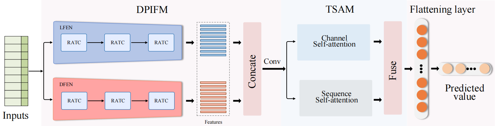

# DFTD
Dual-Path Information Fusion and Twin Attention Driven Global Modeling for Solar Irradiance Prediction

## Architecture of the proposed framework

## Environment

- Python 3.9
- Torch 1.12+
- cuda_11.6
   
   
## National Solar Radiation Database

- [NSRDB](https://nsrdb.nrel.gov/): Thank you for the valuable contributions.

